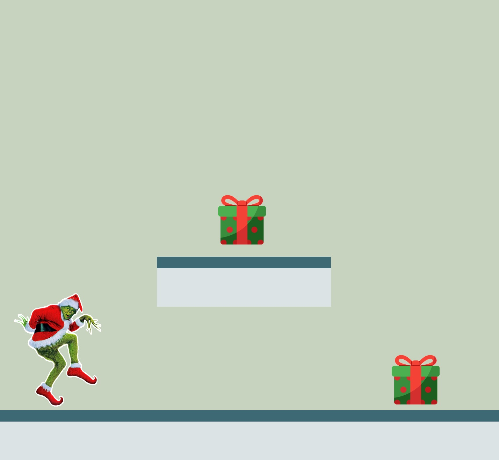

:warning: Everything between << >> needs to be replaced (remove << >> after replacing)

# Christmas Platformer
## CS110 B1 Final Project  1st Semester, 2024

## Team Members
Jyotirmoy Dasroy
Sanju Chacko

***

## Project Description
This 2D platformer is a Christmas-themed game with a Grinch-inspired twist. 
The game includes features like item collection and holiday-themed visual and audio design. 
It aims to combine seasonal aesthetics with engaging gameplay mechanics for a fun and festive experience.

***    

## GUI Design

### Initial Design

### Final Design

## Program Design

### Features

1. start menu
2. moveable character
3. obstacle collisions
4. scrolling background
5. game over screen

### Classes

- << You should have a list of each of your classes with a description >>

## ATP

| Step                 |Procedure             |Expected Results                   |
|----------------------|:--------------------:|----------------------------------:|
|  1                   | Run Counter Program  |GUI window appears with count = 0  |
|  2                   | click count button   | display changes to count = 1      |
etc...
