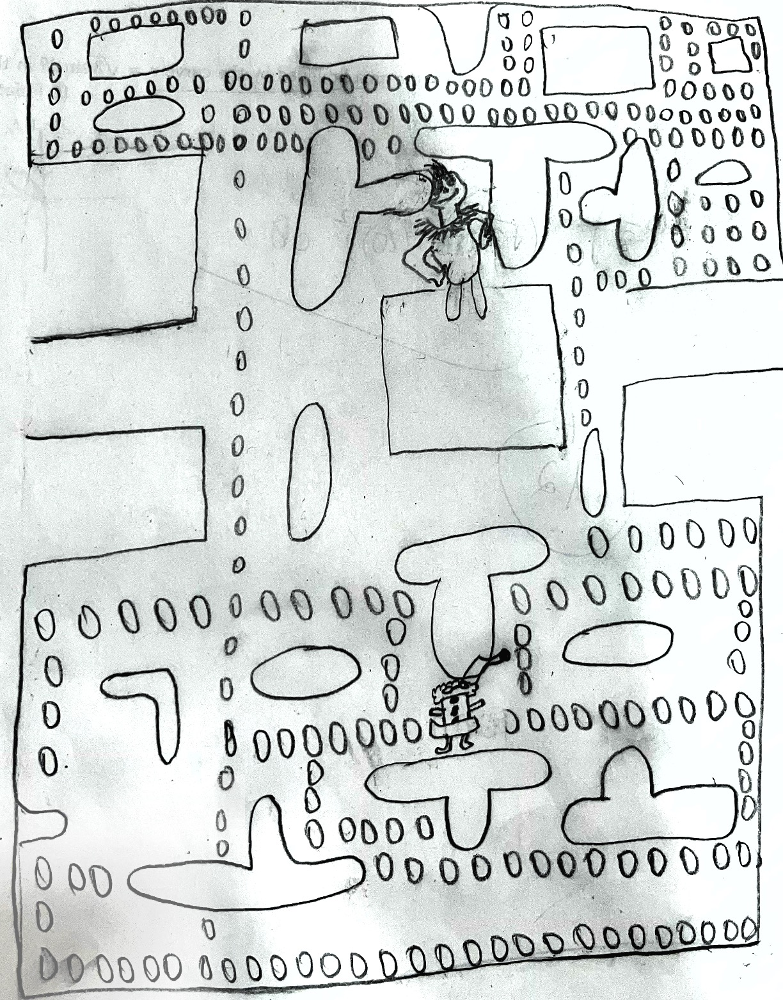

:warning: Everything between << >> needs to be replaced (remove << >> after replacing)

# Santa's Christmas Adventure
## CS110 B1 Final Project  1st Semester, 2024

## Team Members
Jyotirmoy Dasroy
Sanju Chacko

***

## Project Description
This Christmas-inspired 2D present collecter reimagines Pac-Man with a festive twist. 
Players act as santa collecting presents while the Grinch chases santa determined to steal holiday cheer. 
***    

## GUI Design

### Initial Design

### Final Design

## Program Design

### Features

1. start screen
2. moveable character
3. collision
4. score
5. game over screen

### Classes

GameObject
The GameObject class is the base for all objects in the game. It handles loading images, positioning, and collision detection.
Attributes:
image_file - Path to the object's image.
x, y - Position of the object.
image - Loaded image for display.
rect - Rectangle for position and collision.
Methods:
update_position(x, y) - Changes the object's position.

Santa
The Santa class represents the player's character. It extends GameObject and adds movement.
Attributes:
speed - How fast Santa moves.
Methods:
move(direction) - Moves Santa in a given direction (UP, DOWN, LEFT, or RIGHT), keeping him on screen.

Grinch
The Grinch class represents enemies in the game. It extends GameObject and includes movement properties.
Attributes:
dx, dy - Speed of movement in the x and y directions.
Behavior:
The Grinch image is resized to 50x50 pixels.

Present
The Present class represents collectible items. It extends GameObject and resizes the image.
Behavior:
The Present image is resized to 30x30 pixels.
***

## ATP

    | Step                 |Procedure             |Expected Results                   |
    |----------------------|:--------------------:|----------------------------------:|
    |  1                   |Start the game        |GUI window appears with count = 0  |
    |  2                   |Press the UP arrow key| display changes to count = 1      |

    | Step                 |Procedure             |Expected Results                   |
    |----------------------|:--------------------:|----------------------------------:|
    |  1                   | Run Counter Program  |GUI window appears with count = 0  |
    |  2                   | click count button   | display changes to count = 1      |

    | Step                 |Procedure             |Expected Results                   |
    |----------------------|:--------------------:|----------------------------------:|
    |  1                   | Run Counter Program  |GUI window appears with count = 0  |
    |  2                   | click count button   | display changes to count = 1      |

    | Step                 |Procedure             |Expected Results                   |
    |----------------------|:--------------------:|----------------------------------:|
    |  1                   | Run Counter Program  |GUI window appears with count = 0  |
    |  2                   | click count button   | display changes to count = 1      |

    | Step                 |Procedure             |Expected Results                   |
    |----------------------|:--------------------:|----------------------------------:|
    |  1                   | Run Counter Program  |GUI window appears with count = 0  |
    |  2                   | click count button   | display changes to count = 1      |

